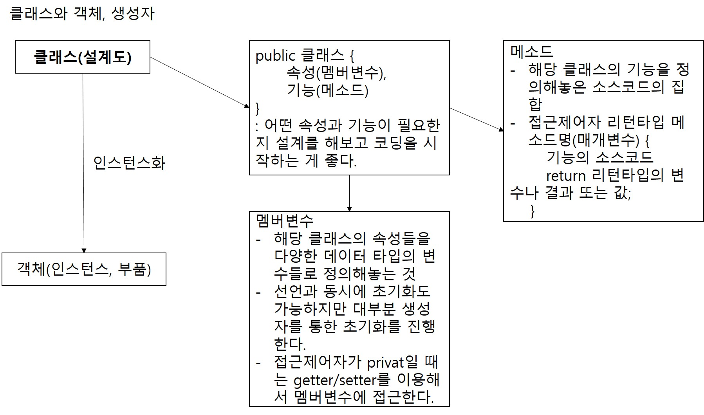
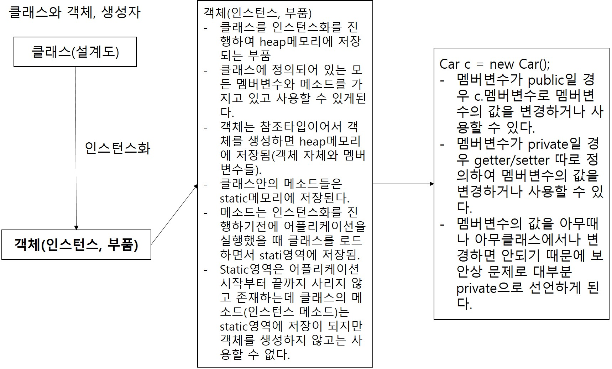

# 1. 객체지향 프로그래밍
1. 객체지향 프로그래밍이란 자바의 특징 중 하나로써 설계도(클래스)대로 부품(객체, 인스턴스)을 만들고 조립하여 프로그램을 완성해가는 방식의 프로그래밍
2. 객체(인스턴스)를 만들기 위해서는 먼저 클래스를 작성해줘야 된다.
3. 위에서 언급된 클래스가 객체 지향 언어의 핵심. 클래스내에는 속성과 기능이 포함된다. 속성은 멤버변수(필드)가 담당하고 기능은 메소드가 담당한다.
4. 세상의 모든 사물들은 클래스로 작성할 수 있고 객체화할 수 있다.  
ex) class 타이어 {
    재질, 모양, 가격....
    휠에 맞춰 넣는다, 모양을 잡는다, 펑크난 곳을 수선한다....
}
5. 기능의 역할을 하는 메소드
1. 메소드는 기능 하나를 수행하는 소스코드의 집합.
2. 메소드를 만드는 방식
접근제어자(public, private, protected, default) 반환타입(메소드가 종료된 다음 전달할 결과값의 타입(int, void:반환할 값 없음(return X), char.., 클래스)) 메소드명(매개변수(파라미터): 메소드를 호출할 때 메소드에 전달해줄 값들. 항상 타입과 순서를 지켜서 전달해야 된다.) {
    기능 코드;
    return 반환타입의 값이나 변수;
}
- 접근제어자 : 클래스, 변수, 메소드 앞에 지정할 수 있고 접근제어자에 따라 해당 클래스, 변수, 메소드를 호출할 수 있는 범위가 달라진다. 접근제어자를 생략하면 default 접근제어자.
- 접근제어자의 범위
    - public > protected > default > private
    - public : 같은 클래스 멤버, 같은 패키지의 클래스, 자식 클래스, 그 외의 모든 영역에서 접근 가능
    - protected : 같은 클래스 멤버, 같은 패키지의 클래스, 자식 클래스(본인클래스를 상속받아 만들어진 클래스)
    - default : 같은 클래스 멤버, 같은 패키지의 클래스
    - private : 같은 클래스 멤버
- 반환타입 : 메소드가 종료된 후 반환(전달해줄)될 결과값의 타입.
    - void : 반환 값이 없음. return문 사용안됨.
    - void가 아닌 타입 : int, char, String, int[]...
                        항상 return문으로 해당 타입의 변수나 값을 반환(return)해야 한다.
- 매개변수(파라미터) : 메소드를 호출할 때 메소드에 전달해줄 변수나 값.
                      메소드가 정의된 부분의 매개변수 타입, 개수, 순서와
                      호출하는 부분의 매개변수 타입, 개수, 순서가 동일해야 한다.
ex) public int add(int num1, int num2) {
    return num1 + num2;
}  
int result = <b style="color: red;">add(1, 2); => 3</b>
- 메소드 오버로딩 : 메소드는 같은 이름으로 중복생성이 불가능한데
                   매개변수에 변화를 줘서 같은 이름으로 메소드를
                   재생성. 같은 이름의 메소드를 여러개 만들 수 있다.
ex) public int add(int num1, int num2, int num3) {
    return num1 + num2 + num3;
} 기존에 존재하던 메소드에서 매개변수에 변화가 생기면 다른 메소드로 인식
- 메소드 오버라이딩 : 상속과 관련된 기능. 부모클래스에 존재하는 메소드를
                     자식클래스에서 다른 기능을 할 수 있도록 재정의. 매개변수나 메소드명, 반환타입 등
                     부모클래스에 존재하는 메소드 원형을 그대로 사용해야 한다.
- 

# 2. 인스턴스화(객체화)와 생성자
1. 인스턴스화
- 클래스(설계도)를 인스턴스(객체, 부품)로 만들어 주는 작업이 인스턴스화
- new 키워드와 생성자를 통해서 진행
- 클래스명과 동일한 메소드를 생성자라고 부르며 생성자를 호출하면
  객체화(인스턴스화)가 진행되면서 멤버변수들을 초기화(int는 0, String은 null)
- 매개변수가 없는 생성자를 기본 생성자라고 하며 정의하지 않아도 기본적으로 제공되기 때문에
  바로 사용할 수 있다.
2. 생성자
- 생성자는 매개변수가 없는 생성자(기본 생성자)와 매개변수가 있는 생성자로 분류
3. 기본 생성자
- 기본 생성자의 정의  
  public 클래스명() {
    //멤버변수 초기화 가능
  }
- 기본 생성자는 클래스를 생성하면 기본적으로 제공되고 매개변수가 있는
  생성자를 정의할 경우 기본 생성자를 정의하지 않으면 사용할 수 없다.
- 기본 생성자 외에 다른 생성자를 정의할 경우 왠만해선 기본 생성자도 함께 정의한다.
4. 매개변수가 있는 생성자
- public 클래스명(타입 매개변수1, 타입 매개변수2, 타입 매개변수3 ...) {
    //매개변수들로 멤버변수들 초기화
  }
- 생성자의 역할은 객체를 만들고 멤버변수들을 초기화해준다.
- 매개변수의 개수는 멤버변수의 최대 개수보다 작거나 같도록 구성한다.
- 기본 생성자는 모두 동일한 객체를 생성하는 데 매개변수가 있는 생성자는
  각각의 특색을 살려서 객체를 생성할 수 있다.
- 
- 