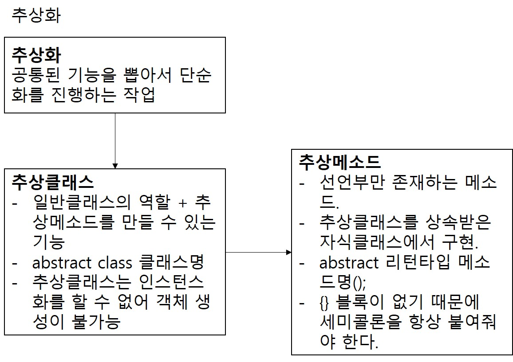

# 1. 추상화
1. 객체를 단순화하는 작업. 기존 객체에서 핵심적인 부분만 남겨놓는 것.
2. 부모클래스의 기능들은 다형성을 통해 거의 동작하지 않으므로 부모클래스에는 기능의 정의만 하고 자식클래스에서 기능을 구현하는 방식.
3. 자바에서 추상화는 인터페이스(Interface)나 추상클래스(Abstract Class)를 통해 이뤄진다.
4. 추상화의 장점
- 추상화는 복잡한 객체를 단순화하여 유지보수성을 높인다.
- 복잡한 코드가 단순화되므로 코드에 대한 이해도와 가독성이 높아진다.
- 추상화를 통해 추상클래스나 인터페이스를 생성하면 코드의 재사용성이 증가한다.

# 2. 추상클래스
1. 추상화 작업이 진행된 클래스.
2. 추상메소드를 작성할 수 있는 것 말고는 일반클래스와 동일하다. 추상클래스는 멤버변수와 일반 메소드도 가질 수 있다. 
3. 추상클래스를 만드는 방식  
- abstract class 클래스명 {}
4. 추상클래스는 미완성된 설계도.
5. 추상클래스는 인스턴스화를 할 수 없다. 객체를 만들 수 없다.

# 3. 추상메소드
1. 메소드는 선언부와 구현부로 나눌 수가 있는데 선언부만 정의해놓는 것이 추상메소드이다.
2. 미완성된 메소드를 작성한다고 생각하면 된다.
3. 추상메소드의 구현부는 상속받은 자식클래스에서 오버라이딩을 통해 정의한다.
4. 추상메소드는 구현부가 없기 때문에 {}블록은 작성하지 않는다.
5. 추상메소드 정의 방식
- abstract 리턴타입 메소드명(매개변수);
6. 구현부에 해당하는 {}블록이 없기 때문에 항상 세미콜론(;)을 붙여야한다.
7. 