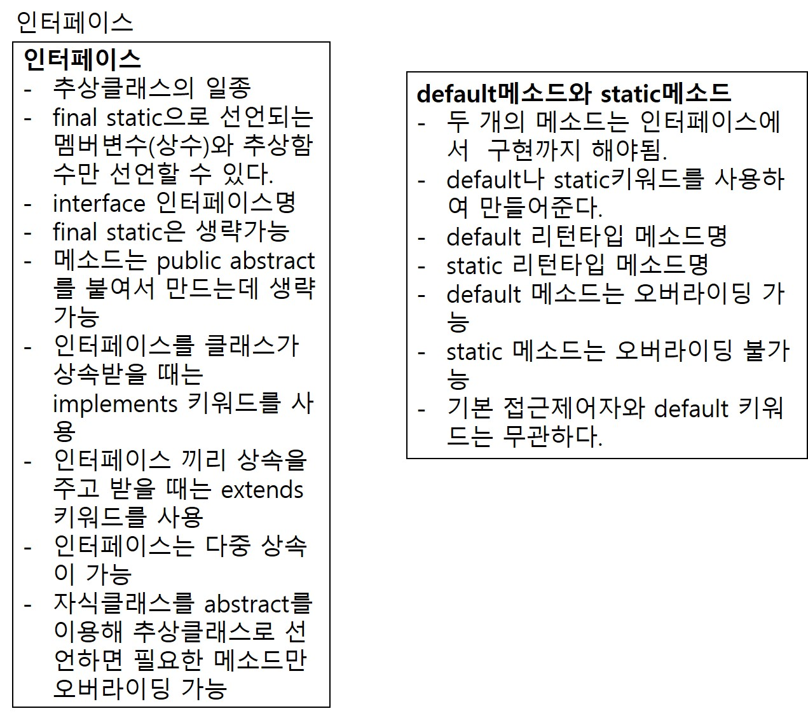

# 1. 인터페이스
1. 인터페이스는 추상클래스의 일종이다.
2. 인터페이스는 추상클래스보다 추상화의 레벨이 더 높다.(더 깊게 추상화됨)
3. 추상클래스는 멤버변수, 일반메소드, 추상메소드를 가질 수 있었는데 인터페이스는 멤버변수, 추상메소드만 가질 수 있다. 멤버변수도 무조건 final키워드로 상수인 변수만 가질 수 있다.
4. 인터페이스가 가질 수 있는 요소의 정의
- 변수는 무조건 public static final으로 시작해야되는데 생략이 가능하다.
- 모든 메소드는 public abstract로 시작해야된다. 마찬가지로 생략가능. 1.8이상부터는 static 메소드와 default 메소드 사용가능.
5. 인터페이스의 정의
- interface 인터페이스명 {
     int ~~~;
     public void ~~~~();
  }
- 컴파일러가 interface를 읽어드리면서 public static final을 생략한 변수에는 자동으로 붙여주고 public abstract를 생략한 메소드에도 자동으로 붙여주게 된다.
6. 인터페이스의 상속
- 인터페이스는 extends가 아니고 implements 키워드를 사용하여 상속한다.  
ex) public 클래스명 <b style="color: red;">implements</b> 인터페이스명 {

    }
- 클래스 상속과 달리 다중상속이 가능하다. 클래스도 인터페이스는 다중으로 상속받을 수 있고 인터페이스 끼리도 다중상속 가능하다.  
ex) public 클래스명 implements 인터페이스1, 인터페이스2 {

}
- 인터페이스 끼리 상속을 주고받을 때는 extends를 사용한다.  
ex) interface 자식 인터페이스 extends 부모1, 부모2{

}
- 인터페이스를 상속받은 클래스중에 인터페이스의 추상메소드 중 일부만 구현하려면 클래스 자체를 추상클래스로 선언해야된다.
7. 인터페이스도 인스턴스화를 통한 객체생성이 불가능하다. 해당 인터페이스를 상속받은 자식클래스를 객체로 만들어서 사용한다.

# 2. default 메소드
1. 부모 인터페이스에 새로운 기능을 추가하려면 추상메소드를 선언하고 자식클래스에서 구현해야되는데 상속받은 자식클래스의 숫자 많아질수록 구현해야하는 코드가 많아진다.
2. 위 문제를 해결하기 위해서 jdk1.8 default 메소드를 통해 부모 인터페이스에만 메소드를 선언하고 구현하도록 유도하고 있다.
3. default 메소드 선언과 구현방식
- 인터페이스 {
    추상메소드1;
    추상메소드2;

    (public) default 리턴타입 메소드명() {
        인터페이스에서 구현부까지 구현한다.
    }
  }
- default 메소드는 접근제어자를 생략하면 public으로 설정된다.
- default 메소드는 오버라이딩도 가능하다.

# 3. 인터페이스의 장단점
1. 인터페이스의 장점
- 다중 상속이 가능하다. 여러개의 인터페이스를 상속받아 구현하면 유연한 객체를 생성할 수 있다.
- 인터페이스를 구현한 클래스를 다른 프로젝트에서도 사용할 있기 때문에 코드의 재사용성이 높아진다.
- default 메소드를 이용하여 새로운 기능을 추가하기도 쉽고 인터페이스에는 메소드를 선언만하고 구현체(상속받은 클래스)에서 구현하면 되기 때문에 유지보수성도 높아진다.
- 인터페이스를 이용하면 다형성도 쉽게 구현할 수 있다. 부모 인터페이스 타입의 변수에 다양한 구현체를 대입하여 여러가지 기능으로 사용할 수 있다.
2. 인터페이스의 단점
- 인터페이스는 추상화 레벨이 높기때문에 설계하고 구현하는 데 시간이 오래 걸린다. 목적과 용도를 정확하게 특정한 상태에서 설계와 구현을 진행해야하기 때문에 구조나 기능을 생각하는데 시간을 투자해야한다.
- 인터페이스에 선언되어 있는 추상메소드를 구현체에서 모두 구현해야된다. 구현체에서 필요없는 기능이라도 인터페이스에 선언되어 있으면 무조건 구현해야되기 때문에 불필요한 코드가 작성된다.
- 상속의 깊이가 깊어지면 구조와 설계 자체가 복잡해진다.
3. 