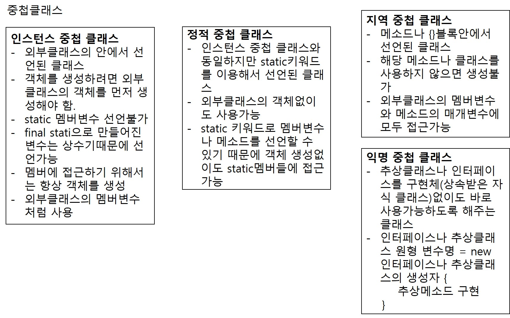

# 1. 중첩클래스
1. 클래스 내부에 다른 클래스를 선언하는 것을 중첩클래스라고 한다. 
2. 중첩클래스의 종류는 정적 중첩 클래스, 인스턴스 중첩 클래스, 지역 중첩 클래스, 익명 중첩 클래스가 존재한다.
3. 정적 중첩 클래스(static nested class)
- 정적 중첩 클래스는 외부 클래스의 정적 멤버(static으로 선언된 변수, 메소드)와 같은 위치에 선언한다.
- 외부 클래스의 객체를 생성하지 않아도 자신의 인스턴스를 생성할 수 있다.
- 외부 클래스의 모든 멤버변수와 메소드에 접근할 수 있다.
- static으로 선언된 정적 중첩 클래스안에는 정적 멤버를 가질 수 있다. 정적 멤버들은 객체를 생성 안해도 접근 가능하지만 일반 멤버들은 객체를 생성해서 접근해야 한다.  
ex) //정적 중첩 클래스의 객체 생성
    NestedClass.Div div = new NestedClass.Div();
    //정적 중첩 클래스의 정적 멤버 접근
    NestedClass.Div.result;
    //정적 중첩 클래스의 일반 멤버 접근
    div.num3; div.getNum3();
4. 인스턴스 클래스(inner class, 인스턴스 클래스)
- 인스턴스 클래스는 외부 클래스의 인스턴스 멤버(멤버변수, 메소드)와 같은 위치에 선언된다.
- 외부 클래스의 객체가 생성된 후에 인스턴스 클래스의 객체를 생성할 수 있다.
- 외부 클래스의 모든 멤버변수와 메소드에 접근할 수 있다.
- 인스턴스 클래스안에는 static 멤버를 선언할 수 없다.
- final static은 상수이기 때문에 선언 가능.  
ex) //인스턴스 클래스의 객체 생성
    //먼저 외부클래스의 객체를 생성한다.
    NestedClass nc = new NestedClass();
    //위에 생성한 외부클래스의 객체를 이용해서
    //인스턴스 클래스의 객체를 생성한다.
    //인스턴스 클래스의 생성자를 외부클래스 객체의
    //멤버처럼 사용한다.
    NestedClass.Mul mul = nc.new Mul();
    //인스턴스 클래스 객체의 멤버 접근
    mul.num1; mul1.getNum1(); mul.multi();
5. 지역 중첩 클래스
- 메소드안에 선언되는 클래스. {} 블록안에 선언되기 때문에 지역 중첩 클래스라고 부른다.
- 외부클래스나 메소드의 매개변수, 지역변수에도 접근이 가능.
- 외부클래스나 메소드 안에서 인스턴스를 만들어야 사용 가능
6. 익명 중첩 클래스
- 인터페이스나 추상클래스를 구현한 클래스의 인스턴스를 생성할 때 사용된다.
- 클래스의 이름이 없고 선언과 동시에 인스턴스를 생성한다.
- 외부클래스나 메소드의 매개변수, 로컬 변수에 접근할 수 있다.
7. 중첩 클래스의 장점
- 같은 파일안에 여러 개의 클래스를 정의할 수 있어서 코드의 가독성을 높일 수 있다.
- 클래스에 접근성을 제한할 수 있다. private 접근제어자를 사용해서 다른 클래스에서는 참조하지 못하는 중첩클래스를 만들어서 사용할 수 있다.
- 외부 클래스의 멤버변수나 메소드에 쉽게 접근할 수 있다.
8. 