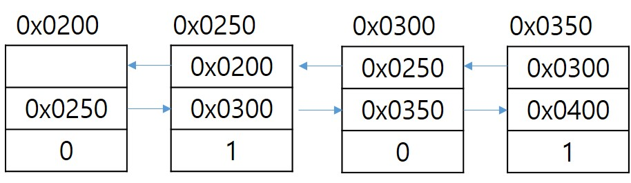

# 1. 컬렉션 프레임워크
## 1. 컬렉션 프레임워크란
1. 다량의 데이터(데이터 그룹)에 대한 표준화된 프로그래밍 방식을 제공해주는 클래스의 집합. 다양한 종류의 다량의 데이터를 다룰 수 있게 클래스들을 제공해준다.(List, Map, Set...)
2. 컬렉션 프레임워크의 핵심 인터페이스
- List : 순서가 있는 데이터의 집합. 데이터의 중복 허용. 상속받은 클래스로는 ArrayList, LinkedList, Vector, Stack...
- Map : 키와 값의 쌍으로 이루어진 데이터의 집합. 키의 중복은 허용되지 않고 값의 중복은 허용됨. 상속받은 클래스로는 HashMap, HashTable, TreeMap...
- Set : 순서를 유지하지 않으면서 중복도 허용되지 않는 데이터의 집합. 상속받은 클래스로는 HashSet, TreeSet...
- 핵심 인터페이스를 상속받은 클래스들을 이용해서 다량의 데이터를 다룰 수 있다.
- List, Set은 Collection을 상속받아서 Collection 인터페이스에 정의되어 있는 메소드를 사용할 수 있다.
- 상속받은 메소드는 다음과 같다.
    - boolean add(Object obj), addAll(Collection c) : 데이터나 데이터를 여러개 가지고 있는 Collection을 마지막에 추가
    - void clear() : Collection 안의 데이터를 모두 삭제
    - boolean cotains(Object obj), containsAll(Collection c) : 매개변수로 받은 데이터나 여러 개의 데이터를 가지고 있는 Collection이 포함되어 있는지를 검사
    - boolean equals(Collection c) : 해당 Collection과 매개변수로 받은 Collection이 동일한지 검사.
    - boolean isEmpty() : 해당 Collection이 비어있는 지 검사
    - Iterator iterator() : Collection의 Iterator를 얻어서 리턴  
    ※ Iterator : Collection의 요소(데이터)에 하나씩 순차적으로 가져오기 위한 인터페이스
    - boolean remove(Object obj) : 해당 Collection에서 매개변수로 받은 데이터를 삭제
    - boolean removeAll(Collection c) : 매개변수로 받은 Collection이 가지고 있는 데이터를 해당 Collection에서 모두 삭제
    - boolean retainAll(Collection c) : 해당 Collection에서 매개변수로 받은 Collection이 가지고 있는 데이터만 남기고 나머지는 삭제
    - int size() : 저장되어 있는 데이터의 개수 리턴
    - Object[] toArray() : 저장되어 있는 데이터를 객체배열로 변환하여 리턴
    - Object[] toArray(Object[] arr) : 저장되어 있는 데이터를 객체배열로 변환하여 지정된 배열에 담아서 리턴.

## 2. List
1. List는 순서가 있고 데이터의 중복을 허용하는 Collection 인터페이스.
2. List 메소드
- Object get(int index) : 해당 index의 데이터를 꺼내는 메소드
- int indexOf(Object obj) : 매개변수로 받은 데이터가 존재하는 위치(인덱스)를 리턴(왼쪽부터 검색)
- int lastIndexOf(Object obj) : 매개변수로 받은 데이터가 존재하는 위치(인덱스)를 리턴(오른쪽부터 검색)
- ListIterator listIterator()  
  ListIterator listIterator(int index) : List 데이터에 하나씩 순차적으로 접근할 수 있는 ListIterator를 리턴
- Object remove(int index) : 인덱스 위치에 있는 데이터를 삭제. 삭제된 데이터를 리턴.
- Object set(int index, Object obj) : 지정된 인덱스 위치에 새로운 데이터를 저장.
- void sort(Comparator c) : 지정된 비교자를 기준으로 정렬.
- List subList(int startIndex, int endIndex) : startIndex ~ endIndex까지의 데이터를 List형태로 리턴

## 3. ArrayList
1. Collection Framework에서 가장 많이 사용되는 클래스 중 하나. List 인터페이스를 상속받아 구현되었으며 순서를 유지하고 데이터의 중복을 허용. 
2. 데이터 형태로 Object를 지정하기 때문에 모든 형태의 데이터를 저장할 수 있다.
3. <E> : Element의 E. 원시 타입을 제외한 참조타입의 형태를 지정할 수 있다. ex) ArrayList<Student> arrList; ArrayList<Integer> arrList; ArrayList arrList; => 타입을 지정 안했을 때는 타입이 Object로 지정됨. 
4. ArrayList 메소드
- ArrayList<T>() : 크기가 10인 ArrayList 객체 생성
- ArrayList<T>(Collection c) : 매개변수로 주어진 Collection이 저장된 ArrayList 객체 생성
- ArrayList<T>(int capacity) : capacity 크기의 ArrayList 객체 생성
- Object clone() : ArrayList를 복제. 깊은 복제. 리턴 타입이 Object여서 ArrayList로 사용하고 싶으면 형변환 필수.
- void trimToSize : capacity를 데이터 개수에 맞춤. 빈 공간 삭제.

## 4. LinkedList
1. 배열은 데이터 읽는 시간이 가장 빠르다는 장점이 있지만
크기를 변경할 수 없고 비순차적인 데이터를 추가하거나 삭제할 때
시간이 오래 걸린다는 단점이 있다.
2. 배열의 단점을 보완하기 위해 만든 것이 LinkedList이다.
3. LinkedList는 불연속적으로 존재하는 데이터를 앞뒤로 서로연결하여
링크를 만든 형태로 되어있다.
4. LinkedList에는 Node라는 내부클래스가 선언되어 있고
Node 클래스 안에는 데이터 값과 이전, 다음 요소를 저장할 수 있는
변수가 존재한다.
5. 
6. LinkedList의 장단점
- 장점 : 중간에 데이터를 추가하거나 삭제하는 작업이 ArrayList나
배열보다 훨씬 빠릅니다.
- 장점 : ArrayList나 배열은 중간 요소에 접근할 때 index를 세면서
접근하게 되는데 LinkedList는 이전요소에 대한 정보와 다음요소 정보를
가지고 있어서 해당 요소로 바로 접근이 가능하고 추가할 때는 
새로운 링크만 만들어주면 되고 삭제할 때는 링크를 끊어주기만 하면된다.
- 단점 : 순차적으로 접근하는 속도가 월등하게 느리다. 
인덱스를 가지고 순차적으로 접근할 때 앞뒤 연결관계를 첫 요소 확인하면서
진행되기 때문에 느려진다.

## 5. Set
1. List는 순서가 있고 중복을 허용하지만 Set 데이터를 저장하는 데
순서가 존재하지 않고 데이터의 중복을 허용하지 않는다.
2. 중복된 값을 Set에 저장하면 해당 값은 저장되지 않는다.
3. Set 메소드
- Set of(데이터 값1, 데이터 값2, 데이터 값3 .....) : 매개변수로 받은
데이터들을 저장하고 있는 Set 객체를 생성하여 리턴
- Set copyOf(Collection c) : Collection을 복사한 후 Set형태로 리턴

## 6. HashSet
1. Set을 상속받아 구현된 가장 대표되는 클래스.
2. Set을 상속받았기 때문에 데이터의 순서가 존재하지 않고
순서가 존재하지 않는다는 의미는 인덱스를 사용할 수 없다는 뜻이다.
중복값도 허용되지 않는다.

## 7. Iterator, ListIterator, Enumeration
1. Iterator, ListIterator, Enumeration은 모두 Collection에
저장되어 있는 요소에 접근할 때 사용한다. Enumeration은 구버전 Iterator
ListIterator는 Iterator의 기능을 향상시킨 Iterator.
2. Collection Framework에서는 Collection에 저장된
데이터를 읽고 사용하는 것을 Iterator를 통해 표준화했다.
3. Iterator 메소드
- boolean hasNext() : 다음 요소(데이터)가 존재하는 지 검사
- Object next() : 다음 요소(데이터)를 읽어서 리턴. 
                  읽은 데이터의 타입으로 리턴
- void remove() : next()로 읽어온 데이터(요소)를 삭제.
                  next() 사용한 후 요소를 읽었을 때 사용한다.
4. ListIterator 메소드
- void add(Object obj) : Collection에 새로운 데이터를 추가
- boolean hasPrevious() : 이전 데이터가 존재하는 지 검사
- Object previous() : 이전 데이터를 읽어오는 메소드. 
                      데이터 타입의 값으로 리턴.
- int nextIndex(), int previousIndex() : 이전 데이터나 다음 데이터의
                                         인덱스를 리턴
- void set(Object obj) : next(), previous()를 사용해서
                         이전 데이터나 다음 데이터를 읽어온 다음 사용가능
                         읽어온 데이터를 매개변수로 받은 obj로 변경

## 8. Map
1. List, Set과는 다르게 Collection을 상속받지 않은 인터페이스
2. Key와 Value로 매핑되어 있는 데이터들의 집합  
ex) {sno : 123, sname : "홍길동", major : "컴공과"}
3. List나 Set 타입을 하나만 지정했는데 Map은 Key와 Value의 타입을
모두 지정할 수 있다. Map<String, String>
4. Map 메소드
- void clear() : Map안의 데이터를 모두 삭제
- boolean containsKey(Object obj) : 매개변수로 받은
obj가 키로 존재하는 지 여부를 검사
- boolean containsValue(Object obj) : 매개변수로 받은
obj가 값으로 존재하는 지 여부를 검사
- Set entrySet() : Map에 저장되어 있는 key, value의 쌍을
Map.Entry(Map 인터페이스 안에 선언되어 있는 내부 인터페이스)
타입으로 저장된 Set을 리턴
- boolean Equals(Object obj) : 동일한 Map인지 비교
- Object get(Object obj) : 매개변수로 받은 key로 
                           해당 key의 value를 꺼내온다.
- Object put(Object key, Object value) : key와 value의 쌍을 만들어서
                                         Map에 저장
- boolean isEmpty() : Map이 비어있는지 검사
- Set keySet() : Map에 저장되어 있는 모든 key를 리턴.
- void putAll(Map map) : 매개변수로 받은 Map에 존재하는 모든
                         key와 value의 쌍을 저장
- Object remove(Object obj) : 매개변수로 받아온 key에 해당하는
                              key, value의 쌍을 삭제
- int size() : Map에 존재하는 key, value의 쌍의 개수 리턴
- Collection values() : Map에 저장되어 있는 모든 value를
                        Collection형태로 담아서 리턴
5. Map.Entry
- Map 인터페이스 안에 선언되어 있는 인터페이스(내부 인터페이스)로 
Map에 저장되어 있는 key, value의 쌍을 다루기 위한 인터페이스.
- 객체지향적으로 설계하도록 유도하기 위해서 선어되어 있고 
Map을 구현할 경우 Map.Entry도 같이 구현해야 된다.
- Entry 메소드
    - boolean equals(Object obj) : 동일한 Entry인지 비교
    - Object getKey() : Entry의 key 리턴
    - Object getValue() : Entry의 value 리턴
    - Object setValue(Object obj) : Entry의 value를 매개변수로 
                                    받은 obj로 변경

## 9. HashMap
1. Map을 구현한 대표적이고 가장 많이 사용되는 클래스.
2. key, value의 쌍을 하나의 엔트리(데이터)로 저장
3. key, value의 타입을 모두 지정할 수 있다.
4. HashMap
- Object clone() : HashMap을 복제해서 리턴
- Object replace(Object key, Object value) : 매개변수로 받은 key의
                                             value를 매개변수로 받은
                                             value로 변경